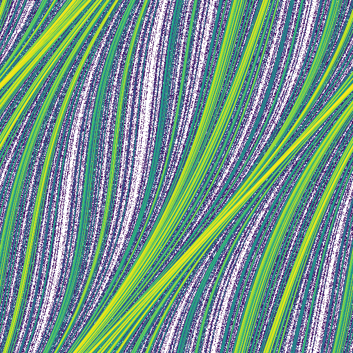

# CoVAT
Collection of Various Attractor Types (in 2D).

## Introduction
Attractors are plots of unique equations. They are created by iterating over an equation multiple times and using the result at each iteration to plot a point. The result is then fed back into the equation. After millions of points have been plotted, fractal-like structures begin to appear. Over time, the repeated points fall into a basin of attraction that forms the unique shape.

## Gallery
Below are a few of my favourite attractors.
<p align="center">
Arnold
</p>


## Attractors
Below are the list of implemented attractors:

| Name          | Number of Parameters | Restrictions  | Source | Link |
| :-----------: |:--------------------:|:-------------:|:-------:|:----:|
| Arnold        | 1                    | ```δ < 1/2π -- 0 ≤ x ≤ 0.2 -- 0 ≤ y ≤ 0.2```| ```Irregular Attractors - Vadim S. Anishchenko & Galina I. Strelkova``` | [PDF](https://www.emis.de/journals/HOA/DDNS/2/153.pdf) | 
| Bedhead       | 2                    | ```-1 ≤ a ≤ 1 -- -1 ≤ b ≤ 1 --x, y == 1.0```   |Discovered by Ivan Emrich -- ```Jason Rampe - 2D Strange Attractors Blog```| [BLOG](https://softologyblog.wordpress.com/2017/03/04/2d-strange-attractors/)|
| Belykh        | 3                    | ```0 < λ < 1/2```  1 < γ ≤ $$2/(1+abs(k))$$  ```abs(k) < 1 -- 0 ≤ x ≤ 1 -- 0 ≤ y ≤ 1```     | ```Belykh Map - Vladimir N. Belykh & Igor Belykh``` | [ARTICLE](http://www.scholarpedia.org/article/Belykh_map)|
|  Belykh V1|  2| --- |```Symbolic dynamics of Belykh-type maps - Denghui Li & Jianhua Xie``` | [ARTICLE](https://link.springer.com/article/10.1007/s10483-016-2080-9)|
| Burgers |  2|```stable for µ < 0.5 -- loses stability at µ = 0.5 -- invariant closed curve when µ exceeds 0.5```  |```Bifurcation Analysis, Chaos and Control in the Burgers Mapping - E. M. ELabbasy, H. N. Agiza, H. EL-Metwally, A. A. Elsadany``` |[PDF](http://www.worldacademicunion.com/journal/1749-3889-3897IJNS/IJNSVol4No3Paper02.pdf) |
| Business Cycle |  2| --- | ```A Business Cycle Model with Cubic Nonlinearity - Tönu Puu & Irina Sushko```| [PDF](http://www.diva-portal.org/smash/get/diva2:227245/FULLTEXT01.pdf)|
|  Cao-Lai|  2| ```0 ≤ x ≤ 1 -- -0.5 ≤ y ≤ 0.5``` | ```Antiphase synchronism in chaotic systems - Ling-Yuan Cao1 & Ying-Cheng Lai```| [PDF](http://chaos1.la.asu.edu/~yclai/papers/PRE_98_CL.pdf)|
|  Cat|  0|  N/A| ```Arnold's Cat Map```|[WIKIPEDIA](https://en.wikipedia.org/wiki/Arnold%27s_cat_map) |
|  Cathala|  2| --- |```Invariant Sets for Windows: Resonance Structures, Attractors, Fractals and Patterns -- Albert D. Morozov, Timothy N. Dragunov, Olga V. Malysheva``` | ---|
|  Chirikov Standard| 1 | ```0 ≤ x ≤ 1 -- 0 ≤ y ≤ 1```|```Ulam method for the Chirikov standard map --  Klaus M. Frahm & Dima L. Shepelyansky``` ```A Glance at the Standard Map -- Ryan Tobin```|[PDF](https://arxiv.org/pdf/1004.1349.pdf) [PDF](https://csc.ucdavis.edu/~chaos/courses/nlp/Projects2009/RyanTobin/A%20Glance%20at%20the%20Standard%20Map.pdf) |
|  Clifford|  4| ```x, y == 0.1 -- -3 < a, b, c, d < 3``` | Discovered by Clifford A. Pickover -- ```Jason Rampe - 2D Strange Attractors Blog```| [BLOG](https://softologyblog.wordpress.com/2017/03/04/2d-strange-attractors/)|
|  Coupled Logistic| 2 |```0 ≤ x ≤ 1 -- 0 ≤ y ≤ 1 -- 1 ≤ µ ≤ 4 -- 0 ≤ ∊ ≤ 1```|```COUPLED LOGISTIC MAP: A REVIEW AND NUMERICAL FACTS -- NEPTAL´I ROMERO, JESUS SILVA, AND RAM ´ ON VIVAS``` ```Chaotic Evaluations in a Modified Coupled Logistic Type Predator-Prey Model -- L. M. Saha and Niteesh Sahni``` ```Spatial Structure, Environmental Heterogeneity, and Population Dynamics: Analysis of the Coupled Logistic Map -- Bruce E. Kendall & Gordon A. Fox``` | [PDF](https://arxiv.org/pdf/1905.12977v1.pdf) [PDF](http://www.m-hikari.com/ams/ams-2012/ams-137-140-2012/sahaAMS137-140-2012.pdf) [PDF](https://escholarship.org/content/qt359696wj/qt359696wj_noSplash_b8e5afe006bbe2c43b98a882cd266309.pdf)|
|  Cross Chaotic| 2 | --- | ```Parallel processing of chaos-based image encryption algorithms -- Ashwin Raman```|[PDF](https://escholarship.org/content/qt6zc2n027/qt6zc2n027.pdf) |
|  DeJong| 4 | --- | ```Peter de Jong Attractors -- Paul Bourke```| [BLOG](http://paulbourke.net/fractals/peterdejong/)|
|  Dual Hénon|  3| --- |```Classifying and quantifying basins of attraction -- J. C. Sprott and Anda Xiong``` | [PDF](https://sprott.physics.wisc.edu/pubs/paper442.pdf)|
|  Elhadj-Sprott C| 2 | ```a < 0 -- b < 0``` |```An example of a fully bounded chaotic sea that surrounds an infinite set of nested invariant tori -- Zeraoulia Elhadj and J. C. Sprott``` |[PDF](https://sprott.physics.wisc.edu/pubs/paper373.pdf) |
|  Fractal Dream| 4 | ```-3 < a, b < 3 -- -0.5 < c, d < 1.5``` | ```Clifford A. Pickover -- Chaos in Wonderland```| [BLOG](https://softologyblog.wordpress.com/2017/03/04/2d-strange-attractors/)|
|  Gingerbreadman|  2|  ---|```Some reminiscences of our study of chaotic maps-2``` |[ARTICLE](https://manasataramgini.wordpress.com/2016/12/26/some-reminiscences-of-our-study-of-chaotic-maps-2/) |
|  Gumowski-Mira|  3| ```-20 < x, y < +20 -- -1 < a, b < 1``` |```	Invariant Sets for Windows: Resonance Structures, Attractors, Fractals and Patterns -- Albert D. Morozov, Timothy N. Dragunov, Olga V. Malysheva``` |[BOOK](https://books.google.de/books?id=6Rrgc_1cN2IC&pg=PA56&lpg=PA56&dq=mira+fractal&source=bl&ots=AIujM4uhTU&sig=2ubJkswWXqw6xE6Qiq0dW9u22B0&sa=X&ei=slYzUJ72I-SB4gS-n4CYCQ&ved=0CCYQ6AEwBjgy#v=onepage&q=mira%20fractal&f=false) |
|  HCA| 2 | --- | ---| [SITE](http://www.3d-meier.de/tut19/Seite98.html)|
|  Heagy-Hammel| 3 |```b = 0.618```  |```Irregular Attractors -- VADIM S. ANISHCHENKO and GALINA I. STRELKOVA``` | [PDF](https://www.emis.de/journals/HOA/DDNS/2/153.pdf)|
|  Hopalong| 3 |```0 < a, b, c < 10```   |--- | ---|
|  Ikeda| 2 | --- | ```A New Hybrid Chaotic Map and Its Application on Image Encryption and Hiding -- Yang Cao```| [ARTICLE](https://www.hindawi.com/journals/mpe/2013/728375/)|
|  Joshi-Blackmore| 2 | --- | ```New Strange Attractors for Discrete Dynamical Systems -- Yogesh Joshi```|[PDF](https://www.semanticscholar.org/paper/New-Strange-Attractors-for-Discrete-Dynamical-Joshi-Joshi/a04101bd7ff88030cbd5b9914b78419a41074945?p2df) |
|  MacMillan| 2 | --- | ```Time–Evolving Statistics of Chaotic Orbits of Conservative Maps in the Context of the Central Limit Theorem -- G. Ruiz, T. Bountis, C. Tsallis```|[PDF](https://arxiv.org/pdf/1106.6226.pdf) |
|  Martin| 1 | --- | ---| [SITE](http://www.3d-meier.de/tut19/Seite60.html)|
|  Maynard-Smith| 2 | --- |```Quasi-periodicity and mode-locking in Maynard Smith map -- Hemanta Kumar Sarmah, Tapan Kumar Baishya, Debasish Bhattacharjee, Mridul Chandra Das``` | [PDF](https://rspublication.com/ijst/dec13/4.pdf)|
|  Mira| 2 | --- | --- |[SITE](https://mathworld.wolfram.com/MiraFractal.html) |
|  Modified Lozi| 2 | --- | ---| ---|
|  Modified Mira| 2 | --- | --- | ---|
|  Multifold Hénon | 2 |  ---|```A Two-dimensional Discrete Mapping with C-infinity Multifold Chaotic Attractors -- Zeraoulia Elhadj & J. C. Sprott``` | [SITE/PDF](https://sprott.physics.wisc.edu/pubs/paper308.htm)|
|  Popcorn| 2 | --- |--- | [SITE](http://paulbourke.net/fractals/popcorn/)|
|  Provenzale-Balmforth|  2| --- |```Chaos and Structures in Geophysics and Astrophysics -- Antonello Provenzale and Neil J. Balmforth``` | [PDF](https://www.whoi.edu/cms/files/antonello_21476.pdf)|
|  Separatrix| 1 | --- |```Ulam method for the Chirikov standard map -- Klaus M. Frahm and Dima L. Shepelyansky``` | [PDF](https://arxiv.org/pdf/1004.1349.pdf)|
|  Sine| 2 | --- | ---| ---|
|  Sine Delay| 2 | --- | ---| ---|
|  Sine Sine| 1 | --- |```Classifying and quantifying basins of attraction -- J. C. Sprott and Anda Xiong``` |[PDF](https://sprott.physics.wisc.edu/pubs/paper442.pdf) |
|  Strelkova-Anishchenko| 2 | --- |```Irregular Attractors -- VADIM S. ANISHCHENKO and GALINA I. STRELKOVA``` | [PDF](https://www.emis.de/journals/HOA/DDNS/2/153.pdf)|
|  Sunflower| 4 | --- | ---| ---|
|  Svensson| 4 | ```-3 < a, b, c, d < 3``` |--- |[SITE](http://paulbourke.net/fractals/peterdejong/) |
|  Tinkerbell| 4 | --- |--- | [WIKIPEDIA](https://en.wikipedia.org/wiki/Tinkerbell_map)|
|  Ushiki| 4 | --- | ```Ergodic theory of chaos and strange attractors - J. P. Eckmann, D. Ruelle```|[PDF](https://www.ihes.fr/~ruelle/PUBLICATIONS/%5b81%5d.pdf) |
|  Yang-Cao| 5 | --- |```A New Hybrid Chaotic Map and Its Application on Image Encryption and Hiding - Yang Cao``` | [ARTICLE](https://www.hindawi.com/journals/mpe/2013/728375/)|


## Requirements
Although you can install ```requirements.txt```, datashader contains all required libraries except for pillow. 
Running ```pip install datashader``` and ```pip install pillow``` will suffice.

## Usage
### Display
Run the ```display_data_shader_image``` function with the attractor you want.
E.g. ```display_datashader_image(attractor.Ikeda)```.
### Export
From ```export.py```, run the ```export_datashader_image``` function with the attractor name as the first param, and the output path as the second param.
E.g. ```export_datashader_image(Hopalong, "/Users/user/Document/Images/")```


## Credits
James Rampe's [2D Strange Attractors Blog](https://softologyblog.wordpress.com/2017/03/04/2d-strange-attractors/)

Jürgen Meier [Attractors](http://www.3d-meier.de/index.html)
